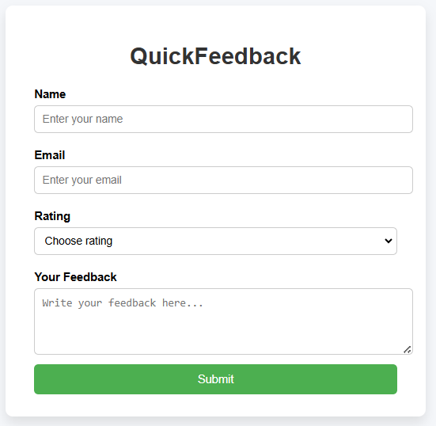

# QuickFeedback – A Smart Feedback Collector App

🚀 A beginner-friendly feedback collection web app built using HTML, CSS, and JavaScript. It allows users to submit feedback with their name, email, rating, and message — and shows a thank-you message after submission.

## 💡 Features
- Responsive and clean UI
- Form validation with `required` fields
- Custom thank-you message after submission
- Beginner-friendly code, no frameworks used

## 📂 Project Structure

## ⚙️ Technologies Used
- HTML5
- CSS3
- JavaScript (DOM Manipulation)

## 📸 Screenshot

## 📌 How to Run Locally
1. Download this repository or clone it.
2. Open the folder on your local system.
3. Double-click `index.html` or open it in your browser.
4. Fill out the feedback form → Click **Submit**
5. A thank-you message will be shown.

## 🤝 Contribution
This project is part of my learning journey. Suggestions and improvements are welcome!
